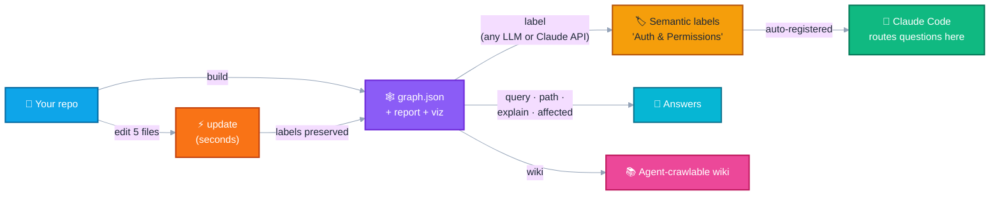
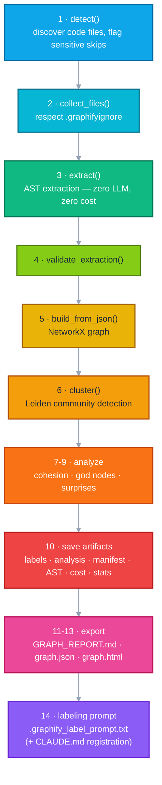

<div align="center">

# 🕸️ graphify-build

### **Persistent knowledge-graph infrastructure for codebases**

**Build once · Query forever · Labels survive · Teams share**

[](https://www.python.org/)
[]()
[]()
[]()
[](https://pypi.org/project/graphifyy/)

*Turn any codebase into a queryable knowledge graph — with incremental updates,<br>
semantic community labeling, multi-repo storage, and automatic Claude Code integration.*

[Quick Start](#-quick-start) · [Why graphify-build?](#-why-graphify-build-instead-of-standard-graphify) · [Commands](#-commands) · [Docker](#-docker) · [Python API](#-python-api)

</div>

---

## ⚡ 30-second tour

```bash
# 1. Build a graph of your repo (AST-only — zero LLM calls, zero cost)
python graphify-build/cli.py build MyBackend --name backend

# 2. Ask it questions
python graphify-build/cli.py query graphify-out-repos/graphify-out-backend/graph.json "how does auth work?"

# 3. You changed 5 files? Update takes seconds, not minutes
python graphify-build/cli.py update MyBackend --name backend

# 4. See everything you've built
python graphify-build/cli.py list
```

```
  NAME            NODES      EDGES  COMMUNITIES  LABELS           UPDATED
  ------------------------------------------------------------------------------
  backend        17,412     31,208          812  812/812 semantic 2026-07-02T10:19
  frontend        8,904     14,551          340  generic          2026-07-01T18:44
```

---

## 🧭 The workflow



Every artifact is a **file on disk** — commit it, share it, clone it. A new teammate gets the labeled graph for free.

---

## 🥊 Why graphify-build instead of standard graphify?

[graphifyy](https://pypi.org/project/graphifyy/) ships excellent **primitives** — AST extraction, Leiden clustering, graph export, a query CLI. But primitives aren't a workflow. Using it raw means hand-wiring **14 library calls** per build, and doing your own path bookkeeping, label management, and output organization.

| | 🔧 Standard graphify (raw) | 🏗️ graphify-build |
|---|---|---|
| **Build a graph** | Write your own script: `detect → collect → extract → validate → build → cluster → score → analyze → report → export` (14 calls, in the right order, with the right cwd) | `build <repo> --name x` — one command |
| **Update after edits** | `detect_incremental` + `build_merge` + manual manifest/path handling — easy to get wrong (path-form mismatches silently re-extract everything or leave ghost nodes) | `update <repo>` — only changed files re-extracted, deleted nodes pruned, verified end-to-end |
| **Community labels** | "Community 0", "Community 1", … forever — or write your own LLM pipeline | Self-contained labeling prompt written **at build time** (works with any LLM, no API key) or one-command `label` via Claude API |
| **Labels after re-cluster / update** | Leiden IDs reshuffle — labels silently attach to the wrong communities | Label preservation built into `update` / `cluster`; stable IDs read from `graph.json` |
| **Multiple repos** | Output lands wherever each script puts it | All graphs in one `graphify-out-repos/` directory + `list` command overview |
| **Claude Code integration** | Manual — explain your graph layout every session | Labeling prompt auto-registers each graph in `~/.claude/CLAUDE.md` routing |
| **Ignore rules** | Hand-write per repo | `.graphifyignore` auto-generated (venvs auto-detected), `.gitignore` auto-updated |
| **Cost / stats tracking** | None | `cost.json` (token usage per run) + `stats.json` (fast summary, powers `list`) |
| **Cross-platform** | You handle path separators, console encodings, binary discovery | Tested on Windows/macOS/Linux: UTF-8-safe console output, venv/conda/uv binary discovery, cross-drive `--out`, Docker image included |

> **TL;DR** — graphifyy is the engine; graphify-build is the car. 🚗

<details>
<summary><b>…and why not the graphify <i>skill</i>?</b> (click to expand)</summary>

<br>

> The graphify skill is a **session tool** — it builds a graph, you use it, you close Claude, it's gone.
> graphify-build is a **persistent team asset**.

On a real large repo — 17,000+ nodes, 800+ communities:

| Scenario | graphify skill | graphify-build |
|---|---|---|
| **Day 1 — label 800 communities** | Claude explores live: bash commands, path discovery, file reads — 2–3 min of tool calls, labels gone when the session closes | Prompt with all communities pre-embedded written at build time; paste into any LLM once; labels persist in `.graphify_labels.json` |
| **Day 2 — you changed 5 files** | Full rebuild, 15–20 min; labels reset | `update` — ~45 sec; labels preserved |
| **Week 2 — new developer joins** | Runs `/graphify` from scratch — 20 min, no shared labels | `git clone` — graph + labels already there, Claude queries in 3 sec |
| **Month 2 — second repo** | Output scattered, manual routing every session | `build <repo-2> --name <name-2>` — lands beside the first graph, CLAUDE.md gains a routing row |

> **The one thing the skill does that graphify-build doesn't:** mixed-media corpora — PDFs, images, video, papers — via semantic subagents. graphify-build is code-only (AST extraction). **For a codebase: graphify-build. For a research corpus: the skill.**

</details>

---

## ✨ What it does

| Feature | Description |
|---------|-------------|
| 🏗️ **Full build** | AST-extract all code, detect communities, export `graph.json` + `graph.html` + `GRAPH_REPORT.md` |
| ⚡ **Incremental update** | Re-extract only changed files, prune deleted nodes, preserve semantic labels |
| 🏷️ **Semantic labeling** | Replace "Community 0" with "Auth & Permissions" via any LLM — no API key needed |
| 🔍 **Query / path / explain / affected** | Answer codebase questions via BFS/DFS graph traversal |
| 📚 **Wiki** | Agent-crawlable wiki — one article per community + god node |
| 📋 **List** | One-screen overview of every graph you've built — without opening a single `graph.json` |
| 🗂️ **Centralized output** | All graphs in one `graphify-out-repos/` directory, named `graphify-out-<name>/` |
| 🤖 **Auto CLAUDE.md registration** | Labeling prompt registers the graph in Claude Code's routing table |
| 🪝 **Git hooks** | Auto-update the graph on every commit |

---

## 🧩 Claude Code Skill — zero-setup path

This repo ships a [Claude Code](https://claude.com/claude-code) skill at `.claude/skills/graphify-build/`. Clone, open Claude Code, and say **"build a knowledge graph of ../MyBackend"** — the skill handles everything:

1. ✅ Checks prerequisites — creates a local `.venv` and installs graphifyy if no interpreter has it
2. 🔎 Locates the tooling from any directory — and if this repo doesn't exist yet, clones it as a **sibling** of your target repo (never inside it)
3. 🏗️ Builds the graph (or runs the fast incremental `update` if one exists), verifies it with `list` and a spot-check query
4. 📣 Briefs you at the end — what was set up, how the pipeline works, where the artifacts live, and the copy-pasteable commands for daily use

Make it available from **any** directory:

```bash
cp -r .claude/skills/graphify-build ~/.claude/skills/
```

---

## 📦 Requirements & Installation

**Python 3.10+** and `uv` (recommended) or `pip`:

```bash
# Recommended — installs graphifyy as a managed tool
uv tool install graphifyy --with anthropic

# Or pip
pip install graphifyy anthropic
```

```bash
git clone https://github.com/Quantum-vik/graphify-build.git
cd graphify-build
```

Run all commands with the Python that has graphifyy installed:

```bash
# Mac / Linux
~/.local/share/uv/tools/graphifyy/bin/python cli.py <command>

# Windows (PowerShell)
$env:APPDATA\uv\tools\graphifyy\Scripts\python.exe cli.py <command>

# If graphify is on PATH (any OS)
python cli.py <command>
```

> 🌍 **Cross-platform:** all path handling uses `pathlib` (forward/backslashes and `~` both work), console output is safe on legacy Windows encodings, the graphify binary is auto-discovered next to your interpreter (venv/conda/uv), and `--out` can point to a different drive or Docker mount.

---

## 🚀 Quick Start

```bash
# Run from your project root (parent of the repos you want to graph)

# 1. Build a graph
python graphify-build/cli.py build <repo-name> --name <name>

# 2. Query it
python graphify-build/cli.py query graphify-out-repos/graphify-out-<name>/graph.json "how does auth work?"

# 3. Label communities (paste the generated prompt into any LLM)
cat graphify-out-repos/graphify-out-<name>/.graphify_label_prompt.txt

# 4. See what you've built
python graphify-build/cli.py list
```

**Output lands in** `graphify-out-repos/graphify-out-<name>/`:

```
graph.json                 — queryable persistent graph
graph.html                 — interactive D3 visualization
GRAPH_REPORT.md            — architecture report
.graphify_labels.json      — community labels
.graphify_analysis.json    — cohesion, god nodes, questions
.graphify_label_prompt.txt — self-contained LLM prompt for labeling
manifest.json              — file state for incremental updates
cost.json                  — token usage log across all runs
stats.json                 — summary stats for fast listing (read by `list`)
```

---

## 🧰 Commands

| Command | What it does |
|---|---|
| [`build`](#build--full-graph-from-scratch) | Full graph: detect → extract → cluster → export all artifacts |
| [`update`](#update--incremental-changed-files-only) | Incremental: re-extract only changed files, prune deleted nodes |
| [`query`](#query--answer-a-codebase-question) | Answer a natural-language question via graph traversal |
| [`path`](#path--shortest-path-between-two-nodes) | Shortest path between two nodes |
| [`explain`](#explain--explain-a-node-and-its-neighbors) | Plain-language explanation of a node + neighbors |
| [`affected`](#affected--blast-radius-analysis) | Blast-radius: everything impacted by changing a node |
| [`label`](#label--automated-semantic-labeling-via-claude-api) | Semantic community names via Claude API |
| [`cluster`](#cluster--re-cluster-without-re-extracting) | Re-run community detection, keep labels |
| [`wiki`](#wiki--agent-crawlable-wiki) | Generate wiki articles per community + god node |
| [`hook`](#hook--auto-update-on-every-git-commit) | Install/uninstall auto-update git hooks |
| [`list`](#list--overview-of-all-built-graphs) | Table of all built graphs (fast — never opens `graph.json`) |

### `build` — full graph from scratch

```bash
python cli.py build <repo-name> [--name NAME] [--out DIR] [--base DIR] [--venv DIR ...] [--force]
```

| Flag | Description |
|------|-------------|
| `--name <name>` | Output → `graphify-out-repos/graphify-out-<name>/` |
| `--out /path` | Custom output path (overrides `--name`; may be on another drive/mount) |
| `--base /path` | Working directory (default: cwd) |
| `--venv <dir>` | Virtualenv dirs to exclude (auto-detected if omitted) |
| `--force` | Overwrite `graph.json` even if rebuild has fewer nodes |

```bash
python graphify-build/cli.py build <repo-1> --name <name-1>
python graphify-build/cli.py build <repo-2> --name <name-2>
```

---

### `update` — incremental (changed files only)

```bash
python cli.py update <repo-name> [--name NAME] [--out DIR] [--base DIR] [--force]
```

Re-extracts **only** files changed since the last build, prunes nodes of deleted files, and preserves semantic labels. Falls back to a full build if no manifest exists. Prints `Nothing changed` and exits fast when the repo is untouched.

```bash
python graphify-build/cli.py update <repo-name> --name <name>
```

---

### `query` — answer a codebase question

```bash
python cli.py query <graph.json> "<question>" [--dfs] [--budget N]
```

> ⚠️ Never read `graph.json` directly — files are 50–500 MB. Always use `query`.

```bash
python cli.py query graphify-out-repos/graphify-out-<name>/graph.json "how does auth work?"
python cli.py query graphify-out-repos/graphify-out-<name>/graph.json "what calls <ServiceName>?" --dfs
python cli.py query graphify-out-repos/graphify-out-<name>/graph.json "where is rate limiting?" --budget 3000
```

---

### `path` — shortest path between two nodes

```bash
python cli.py path <graph.json> "<NodeA>" "<NodeB>"
```

---

### `explain` — explain a node and its neighbors

```bash
python cli.py explain <graph.json> "<NodeName>"
```

---

### `affected` — blast-radius analysis

```bash
python cli.py affected <graph.json> "<NodeName>" [--depth N] [--relations calls,imports]
```

Find every node impacted by changing a given node. Essential before touching a god node.

```bash
python cli.py affected graphify-out-repos/graphify-out-<name>/graph.json "<NodeName>" --depth 2
```

---

### `label` — automated semantic labeling via Claude API

```bash
# Mac/Linux
ANTHROPIC_API_KEY=sk-ant-... python cli.py label graphify-out-repos/graphify-out-<name>

# Windows (PowerShell)
$env:ANTHROPIC_API_KEY="sk-ant-..."; python cli.py label graphify-out-repos\graphify-out-<name>
```

Calls the Claude API in batches of 100 communities. Regenerates `GRAPH_REPORT.md` and `graph.html`. A single malformed batch is skipped with a warning — it never crashes the run.

---

### `cluster` — re-cluster without re-extracting

```bash
python cli.py cluster graphify-out-repos/graphify-out-<name>/graph.json
```

Reruns Leiden community detection on the existing graph. Preserves semantic labels for community IDs that survive.

---

### `wiki` — agent-crawlable wiki

```bash
python cli.py wiki graphify-out-repos/graphify-out-<name>
```

Generates `wiki/index.md` + one article per community + one per god node. Uses stable IDs from `graph.json` — never re-clusters. Communities without a semantic label get a generic one instead of being dropped.

---

### `hook` — auto-update on every git commit

```bash
python cli.py hook install   <repo-path>
python cli.py hook uninstall <repo-path>
```

---

### `list` — overview of all built graphs

```bash
python cli.py list [--base DIR]
```

Lists every graph under `graphify-out-repos/` in a table — name, nodes, edges, communities, whether labels are semantic or still generic, and last update time. Reads only the small `stats.json` per graph — never the huge `graph.json`. Works without graphifyy installed.

---

## 🏷️ Semantic Community Labeling

After every build, graphify-build writes `.graphify_label_prompt.txt` — a fully self-contained prompt with all community data, naming rules, node/edge counts, exact regeneration script, and a final step to register the graph in `~/.claude/CLAUDE.md`.

**Option A — any LLM, no API key:**

```bash
cat graphify-out-repos/graphify-out-<name>/.graphify_label_prompt.txt
# paste into Claude Code, ChatGPT, Cursor, Copilot, etc.
```

The LLM completes all four steps:
1. ✍️ Write `.graphify_labels.json` with semantic names
2. 🔄 Run the embedded regeneration script → rebuild `GRAPH_REPORT.md` + `graph.html`
3. 🚫 Skip re-clustering (community IDs are stable in `graph.json`)
4. 🤖 Update `~/.claude/CLAUDE.md` — routing table, locations list, cache cleanup

**Option B — automated via CLI (requires API key):**

```bash
ANTHROPIC_API_KEY=sk-ant-... python graphify-build/cli.py label graphify-out-repos/graphify-out-<name>
```

Labels survive the next `update` — community IDs that carry over keep their semantic names.

---

## 🙈 .graphifyignore

graphify-build creates a `.graphifyignore` in each repo on first build. Excludes non-code files so graphify uses AST-only extraction — zero LLM calls, zero cost.

**Always excluded (all project types):**

```
*.min.js  *.min.css  *.map          # minified bundles
node_modules/  dist/  build/        # compiled output
__pycache__/   *.pyc                # Python bytecode
*.pdf  *.png  *.jpg  *.csv  ...     # binary / data files
```

**Python backend repos** — add manually if you have a static JS folder:

```
*.js
*.css
```

**Frontend repos** — leave `*.js` / `*.ts` out so your source is included.

---

## 🗂️ Output Directory Layout

```
graphify-out-repos/
├── graphify-out-<name>/
│   ├── graph.json                  # queryable persistent graph
│   ├── graph.html                  # interactive D3 visualization
│   ├── GRAPH_REPORT.md             # architecture report
│   ├── .graphify_labels.json       # community labels (generic or semantic)
│   ├── .graphify_analysis.json     # cohesion, god nodes, questions
│   ├── .graphify_label_prompt.txt  # self-contained LLM labeling prompt
│   ├── .graphify_detect.json       # last detection result
│   ├── .graphify_ast.json          # raw AST extraction (compact)
│   ├── .graphify_python            # exact Python interpreter used during build
│   ├── manifest.json               # file state for incremental updates
│   ├── cost.json                   # token usage per run
│   ├── stats.json                  # summary stats for fast listing (used by `list`)
│   └── wiki/                       # agent-crawlable wiki (if generated)
├── graphify-out-<name-2>/
└── graphify-out-<name-3>/
```

---

## 🐳 Docker

```bash
# Build image
docker build -t graphify-build .

# Full build
docker run --rm \
  -v /path/to/repos:/repos \
  -v /path/to/graphify-out-repos:/graphs \
  graphify-build build /repos/<repo-name> --out /graphs/graphify-out-<name>

# Query
docker run --rm \
  -v /path/to/graphify-out-repos:/graphs \
  graphify-build query /graphs/graphify-out-<name>/graph.json "how does auth work?"

# Label
docker run --rm \
  -e ANTHROPIC_API_KEY=sk-ant-... \
  -v /path/to/graphify-out-repos:/graphs \
  graphify-build label /graphs/graphify-out-<name>
```

---

## ⚙️ How it works



`update` runs the same pipeline but steps 1–3 only process **changed** files, using `detect_incremental()` + `build_merge()` to merge into the existing graph — with all reported paths normalized to the graph's own path form, so re-extracted files replace (never duplicate) their old nodes and deleted files are actually pruned.

---

## 🐍 Python API

```python
from service import build, update, cluster_only, wiki, label_communities, list_graphs
from service import query, shortest_path, explain, affected
from service import load_graph_json, communities_from_graph, node_labels_from_graph

# Build
build("<repo-name>", out_dir="graphify-out-repos/graphify-out-<name>", base_dir="/path/to/root")

# Incremental update
update("<repo-name>", out_dir="graphify-out-repos/graphify-out-<name>", base_dir="/path/to/root")

# Query
answer = query("graphify-out-repos/graphify-out-<name>/graph.json", "how does auth work?")

# Blast-radius
impact = affected("graphify-out-repos/graphify-out-<name>/graph.json", "<NodeName>", depth=3)

# Overview of all graphs (returns list of dicts, prints a table)
graphs = list_graphs("/path/to/root")

# Graph utilities
raw         = load_graph_json("graphify-out-repos/graphify-out-<name>/graph.json")
communities = communities_from_graph(raw)   # {community_id: [node_id, ...]}
node_labels = node_labels_from_graph(raw)   # {node_id: human_label}
```

---

## ⚠️ Known graphifyy Limitations

| Issue | Workaround |
|-------|------------|
| Leiden community IDs reshuffle on every re-cluster | Never call `cluster()` on a labeled graph — use `communities_from_graph()` to read stable IDs |
| HTML viz crashes for graphs > 10k nodes | graphify-build catches `ValueError` and skips HTML silently |
| Duplicate labels collapse sections in `GRAPH_REPORT.md` | Label prompt requires unique labels per community |

---

## 📁 Repo Structure

```
graphify-build/
├── cli.py                       # entry point — all commands
├── service/
│   ├── __init__.py              # public API exports
│   ├── core.py                  # build, update, cluster_only, wiki, label_communities, list_graphs
│   ├── llm_build_prompt.py      # build_label_prompt() — self-contained LLM labeling prompt
│   ├── queries.py               # query, path, explain, affected
│   └── utils.py                 # Python/binary detection, .graphifyignore, graph.json helpers
├── requirements.txt
├── Dockerfile
└── pyrightconfig.json           # suppresses Pylance false positives
```

---

<div align="center">

Built on top of [graphifyy](https://pypi.org/project/graphifyy/) &nbsp;·&nbsp; Maintained by [@Quantum-vik](https://github.com/Quantum-vik)

⭐ If this saves you a rebuild, star the repo.

</div>
